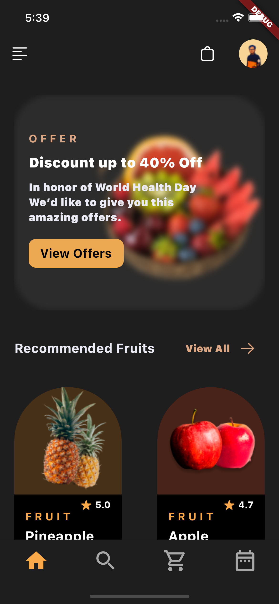

<h1>Flutter Fruit Shop App</h1>

<h2>Screens: </h2>

<p align="center">


<h2>Usage: </h2>

```bash

git clone https://github.com/universal-developer/flutter-fruit-app

cd flutter-fruit-app

flutter pub get

flutter run

```

<h2>Link on template: </h2>

```bash
https://www.figma.com/file/fmokxxvz2PhPzhoiwzOFm0/Fruit-Shop-Mobile-App-UI-(Community)?node-id=1%3A335
```
